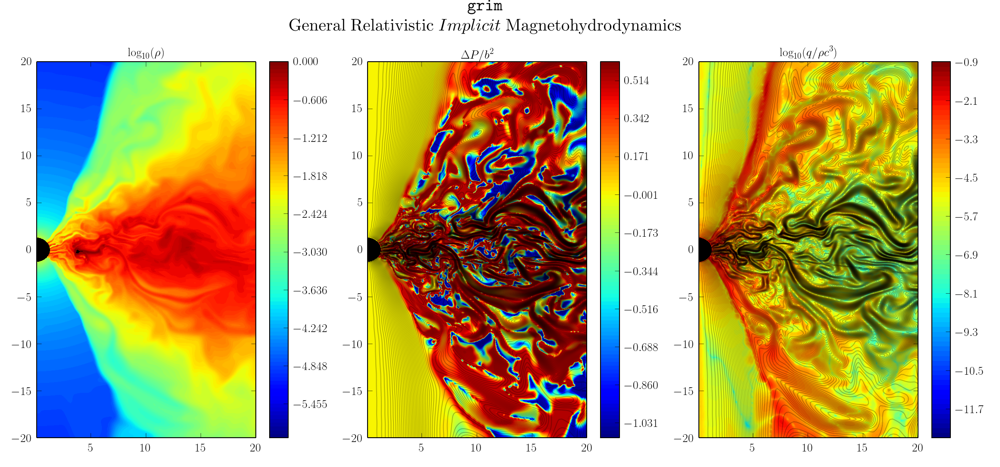

{: style="max-width: 900px; height: auto;"}

#### What is $$\mathtt{grim}$$ ?
---
$$\mathtt{grim}$$ is a conservative, shock-capturing code designed to solve a
broad range of physical models that describe plasmas in general relativity away
from local thermodynamic equilibirum. It is currently being used to study
accretion flows around Kerr blackholes in order to make predictions on the
emissions and spectra from
[SgrA\*](https://en.wikipedia.org/wiki/Sagittarius_A*), the supermassive
blackhole at the center of the Milky Way whose horizon scale will be resolved by
the [Event Horizon Telescope](http://www.eventhorizontelescope.org/).

## Authors
---
**Mani Chandra** 
Illinois Distinguished Fellow   
Department of Astronomy  
University of Illinois, Urbana-Champaign 
<manic@illinois.edu>

**Francois Foucart** 
Einstein Fellow  
Lawrence Berkeley National Laboratory 
<fvfoucart@lbl.gov> 
[Webpage](https://sites.google.com/site/francoisfoucart/home)

**Charles F. Gammie** 
Professor  
Department of Astronomy, _and_ 
Department of Physics  
University of Illinois, Urbana-Champaign  
<gammie@illinois.edu> 
[Webpage](http://rainman.astro.illinois.edu/gammie/)
